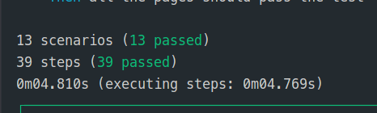

# Documentation Behaviour Driven Development

## 📕 Introduction

Le BDD (Behaviour Driven Development) est une méthode de développement logiciel qui encourage la collaboration entre les développeurs, les testeurs et les intervenants non techniques d'un projet logiciel. Le BDD est une évolution du TDD (Test Driven Development) et de l'ATDD (Acceptance Test Driven Development). Il est principalement utilisé dans les projets de développement Agile. Dans ce cas précis, il est utilisé dans le cadre des cours de `Dév' Qualité` à l'IUT de Blagnac, à destionation de [Jean-Michel Bruel](https://github.com/jmbruel) / @jmbruel

## 📕 Contexte

Le sous-projet BDD s'est concentré autour du `Frontend` de l'application, réalisé en `React` par [Thomas TESTA](https://github.com/SkyFriz), [Eric PHILIPPE](https://github.com/Eric-Philippe). React n'étant pas du tout compatible de manière saine avec [cucumber](https://cucumber.io/), nous avons décidé d'essayer plusieurs méthodes pour nous en approcher le plus possible.

## 📕 Sommaire

- [📕 Introduction](#-introduction)
- [📕 Contexte](#-contexte)
- [📕 Sommaire](#-sommaire)
- [📕 Prérequis](#-prérequis)
- [Tests unitaires - Cucumber / Basiques](#tests-unitaires---cucumber--basiques)
  - [📕 Scénario 1 - Contrôler que la méthode pour récupérer l'année actuelle est toujours à jour](#-scénario-1---contrôler-que-la-méthode-pour-récupérer-lannée-actuelle-est-toujours-à-jour)
  - [📕 Scénario 2 et 3 - Contrôler que la conversion des états des SAE reçus du backend (int) est correctement faite](#-scénario-2-et-3---contrôler-que-la-conversion-des-états-des-sae-reçus-du-backend-int-est-correctement-faite)
- [Tests unitaires - Cucumber / React Testing Library](#tests-unitaires---cucumber--react-testing-library)
  - [📕 Scénario 1 - Contrôler que tous les tests unitaires sont bien faits](#-scénario-1---contrôler-que-tous-les-tests-unitaires-sont-bien-faits)
- [Tests d'intégration - Cucumber / Shell](#tests-dintégration---cucumber--shell)
  - [📕 Scénario 1 - Contrôler que toutes les pages du site contiennent bien tous les éléments de base](#-scénario-1---contrôler-que-toutes-les-pages-du-site-contiennent-bien-tous-les-éléments-de-base)

## 📕 Prérequis

- [NodeJS](https://nodejs.org/en/) (version >= 14.15.4)
- [npm](https://www.npmjs.com/) (version 6.14.10)

Pour l'entièreté de ces tests, il faut se placer dans le dossier `frontend/` du projet, et lancer la commande `npm install` pour installer toutes les dépendances nécessaires. Tout est défini dans le fichier `package.json`, parmi les dépendances et les scripts.
Le script pour lancer les tests cucumber est `npm run test:cucumber`.

## Tests unitaires - Cucumber / Basiques

> Ces tests sont réalisés avec [cucumber](https://cucumber.io/), sur des fichiers Typescript intrasèquement indépendants du projet React. L'idée ici étant surtout de se concentrer sur l'utilisation de cucumber et de ses fonctionnalités.

### 📕 Scénario 1 - Contrôler que la méthode pour récupérer l'année actuelle est toujours à jour

> Ce scénario permet de contrôler que la méthode utilisée dans tout le projet renvoie toujours la bonne année, et que le format de la date est toujours le même.

_Gherkin_

```gherkin
Scenario: Putting the right year on the Copyright Component
    Given The usage of the Copyright Component
    When I display the year of the copyright
    Then The year should be the current year
```

_Steps_

```typescript
Given("The usage of the Copyright Component", async function () {
  console.log("Rendering Copyright");
});

When("I display the year of the copyright", async function () {
  year = getCurrentYear();
});

Then("The year should be the current year", async function () {
  expect(year).to.be.equal(new Date().getFullYear());
});
```

> L'approche ici est très basique, mais contrôle le bon fonctionnement de la méthode `getCurrentYear()`, qui est utilisée dans tout le projet.

### 📕 Scénario 2 et 3 - Contrôler que la conversion des états des SAE reçus du backend (int) est correctement faite

> Ce scénario permet de contrôler que la méthode utilisée pour convertir les états des SAE reçus du backend (int) en string est correctement faite.

> La seconde partie du scénario permet de contrôler que la méthode de conversion pour passer des énumérations du frontend produisent bien un texte lisible par l'utilisateur.

_Gherkin_

```gherkin
  Scenario Outline: Converting an API SAE Status to a Frontend SAE Status
    Given the number given from the API is <apiStatus>
    When I convert the API status to a Frontend status
    Then the Frontend status should be "<frontendStatus>"
    Examples:
        | apiStatus | frontendStatus               |
        | 0         | PENDING_USERS                |
        | 1         | PENDING_WISHES               |
        | 2         | LAUNCHED                     |
        | 3         | LAUNCHED_OPEN_FOR_INTERNSHIP |
        | 4         | CLOSED                       |

    Scenario Outline: Converting a Frontend SAE Status to a Human Readable Text
        Given the Frontend status is "<frontendStatus>"
        When I convert the Frontend status to a human readable text
        Then the human readable text should be "<humanReadableText>"
        Examples:
            | frontendStatus               | humanReadableText                               |
            | PENDING_USERS                | En attente du remplissage des fiches étudiantes |
            | PENDING_WISHES               | En attente du remplissage des voeux             |
            | LAUNCHED                     | Lancée                                          |
            | LAUNCHED_OPEN_FOR_INTERNSHIP | Lancée et ouverte aux alternants                |
            | CLOSED                       | Clôturée                                        |
```

_Steps_

```typescript
let int_status: number;
let sae_status: SAEStatus;
let htext_status: string;

Given("the number given from the API is {int}", function (int) {
  int_status = int;
});

When("I convert the API status to a Frontend status", async function () {
  sae_status = convertSaeIntToStatutEnum(int_status);
});

Then("the Frontend status should be {string}", function (string) {
  expect(sae_status).to.be.equal(string);
});

Given("the Frontend status is {string}", function (string) {
  sae_status = string;
});

When(
  "I convert the Frontend status to a human readable text",
  async function () {
    htext_status = convertSaeStatutEnumToHText(sae_status);
  }
);

Then("the human readable text should be {string}", function (string) {
  expect(htext_status).to.be.equal(string);
});
```

## Tests unitaires - Cucumber / React Testing Library

> Ces tests sont réalisés avec [cucumber](https://cucumber.io/), mais déportés dans les tests unitaires de React. L'idée ici étant d'essayer l'approche plus éloignée de simplement s'assurer que les tests unitaires sont bien faits.

### 📕 Scénario 1 - Contrôler que tous les tests unitaires sont bien faits

_Tests unitaires_

```typescript
import { render, screen } from "@testing-library/react";
import Copyright from "./components/Copyright";

describe("React Common Tests", () => {
  test("renders the right year", () => {
    render(<Copyright />);
    const currentYear = new Date().getFullYear();
    const goodYear = screen.getByText(currentYear.toString());
    expect(goodYear).toBeInTheDocument();
  });
});
```

> On contrôle ici que le composant `Copyright` affiche toujours la bonne année, permettant de garder le copyright à jour.

_Gherkin_

```gherkin
  Scenario: Running all the React tests
    Given a node script to run all the React tests
    When I run the script
    Then all the tests should pass
```

> Le but est ici alors de simplement lancer le framework de tests unitaires de React, et de vérifier qu'il ne retourne pas d'erreur.

_Steps_

```typescript
let command: string;
let exitCode: number = 0;

Given("a node script to run all the React tests", async function () {
  command = "bash ./scripts/runTests.sh";
});

When("I run the script", async function () {
  // Utilise une promesse pour attendre la fin de l'exécution de la commande
  const runTestsPromise = new Promise<void>((resolve) => {
    exec(command, (error, stdout, stderr) => {
      if (error) {
        exitCode = 1;
        console.error(`Erreur d'exécution : ${error}`);
      } else {
        console.log(`Sortie standard : ${stdout}`);
        console.error(`Sortie d'erreur : ${stderr}`);
      }
      // Indique que l'exécution est terminée
      resolve();
    });
  });

  // Attend que la promesse se résolve avant de passer à l'étape suivante
  await runTestsPromise;
});

Then("all the tests should pass", async function () {
  expect(exitCode).to.be.equal(0);
});
```

## Tests d'intégration - Cucumber / Shell

> Ces tests sont réalisés avec [cucumber](https://cucumber.io/), mais déportés dans des scripts shell. L'idée ici étant d'essayer l'approche de s'assurer du bon lancement d'un script encore plus déporté que les tests unitaires.

> Le but du script shell étant de contrôler que toutes les pages du site (fichiers localisés dans le dossier ./pages) contiennent bien tous les éléments de base (header, footer, template vide ...)

### 📕 Scénario 1 - Contrôler que toutes les pages du site contiennent bien tous les éléments de base

_Script Shell_

```shell
#!/bin/bash

pagesDir="./src/pages"

errorFound=0  # Variable pour suivre l'état d'erreur

# Utilise find pour rechercher tous les fichiers du dossier pages/ et ses sous-dossiers
files=$(find "$pagesDir" -type f)

for pageFile in $files; do
  echo "Checking $pageFile"

  # Vérifie la présence de "// Ignore test" dans le fichier
  if grep -q '// Ignore test' "$pageFile"; then
    echo "ℹ️ Skipping tests for $pageFile (contains '// Ignore test')"
    continue
  fi

  # Vérifie la présence de "BlankPage" au moins trois fois dans le fichier
  if [ "$(grep -o 'BlankPage' "$pageFile" | wc -l)" -ge 3 ]; then
    echo "✅ BlankPage structure found at least three times in $pageFile"
  else
    echo "❌ Error: BlankPage structure not found at least three times in $pageFile"
    errorFound=1  # Marque l'erreur
  fi

  # Ajoute d'autres vérifications au besoin en fonction de la structure réelle de BlankPage
done

# Si une erreur a été trouvée, renvoie un code d'erreur
if [ "$errorFound" -eq 1 ]; then
  exit 1
fi
```

_Gherkin_

```gherkin
    Scenario: Check pages integrity
    Given all the app pages in the pages folder
    When I check that all the pages contains the basics components BlankLayout, Header, Footer
    Then all the pages should pass the test
```

## 📕 Résultats


